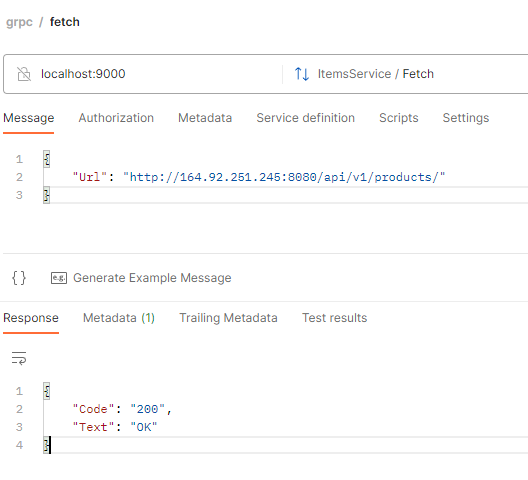
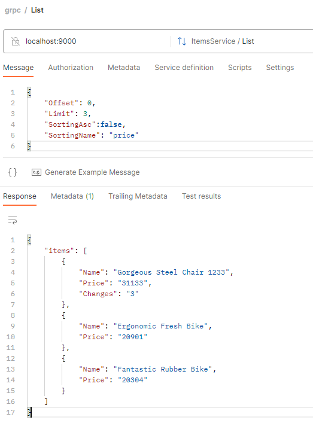

# Реализация gRPC сервиса для получения данных из стороннего сервиса в формате CVS


### Стэк

- go 1.19
- protobuf 3.17.3
- mongoDB

### ТЗ
Сервер принимает запрос от клиента `Fetch(url string)`, где `url` - ссылка на API эндпонит сервиса, по которому можно получить CSV файл. CSV-файл имеет вид PRODUCT NAME;PRICE.
При получении этого запроса, он подтягивает актуальную информацию из .csv и происходит создание \ обновление в БД MongoDB информации о продукции.
Последняя цена каждого продукта сохранена в базе с датой запроса. Также сохраняем количество изменений цены продукта.

Второй gRPC метод `List(<limit>, <offset>, <<sorting name>, <sorting Asc>)` принимает кастомные структуры с параметрами для сортировки и пагинации.

### Запуск

Для запуска необходимо указать переменные окружения, например в файле .env директории internal/config/app.env

```
DB_URI=mongodb://localhost:27017
DB_USERNAME=admin
DB_PASSWORD=g0langn1nja
DB_DATABASE=audit
SERVER_PORT=9000
```

Для mongo используется Docker

```
docker run --rm -d --name audit-log-mongo -e MONGO_INITDB_ROOT_USERNAME=admin \
-e MONGO_INITDB_ROOT_PASSWORD=g0langn1nja -p 27017:27017 mongo:latest
```

Для генерации и обновления protobuf файлов

```
protoc --proto_path=./proto --go_out=./gen/item --go_opt=paths=source_relative --go-grpc_out=require_unimplemented_servers=false:./gen/item --go-grpc_opt=paths=source_relative items.proto 
```

Примеры запросов и их результат в Postman'e:

